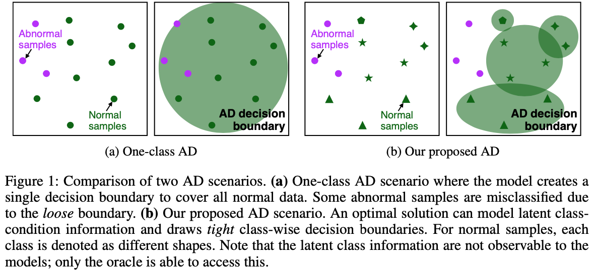
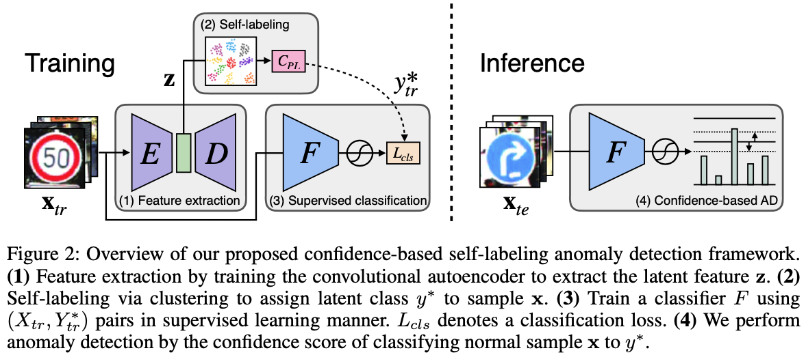
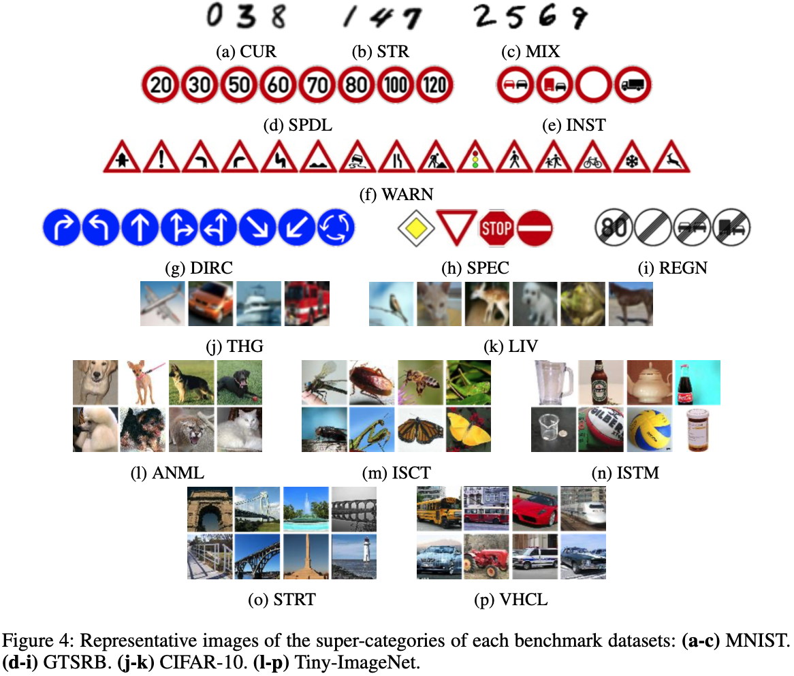
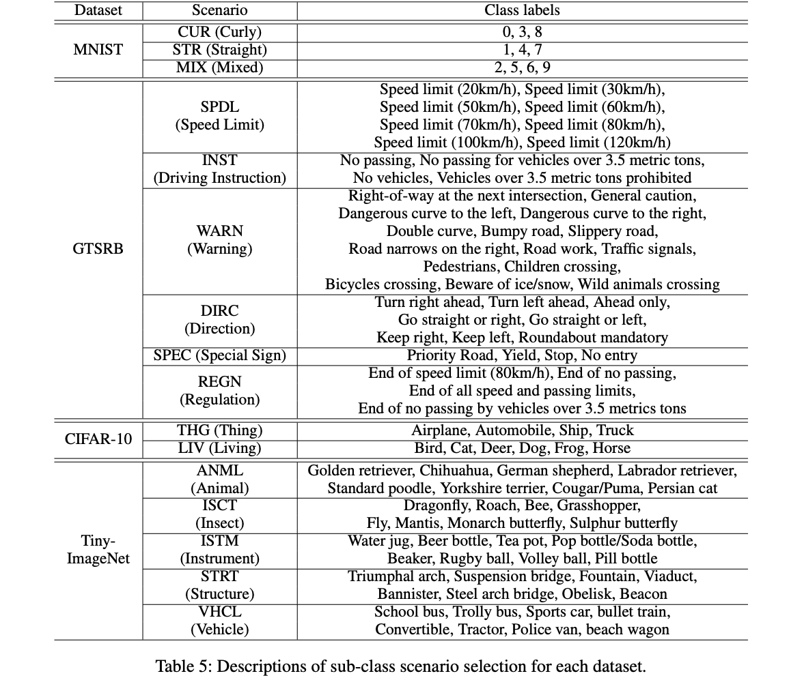
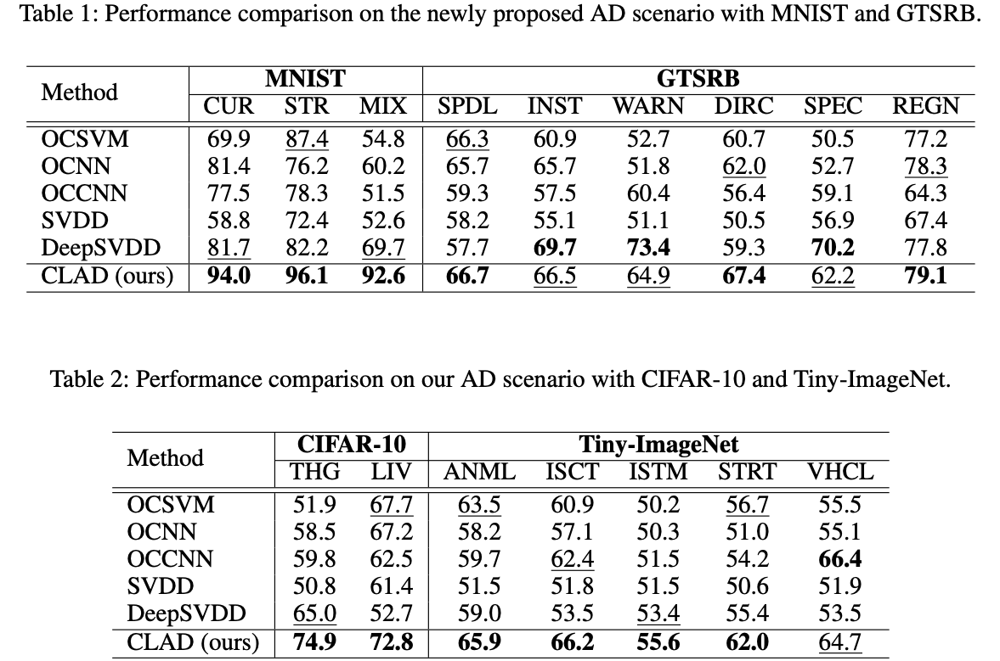
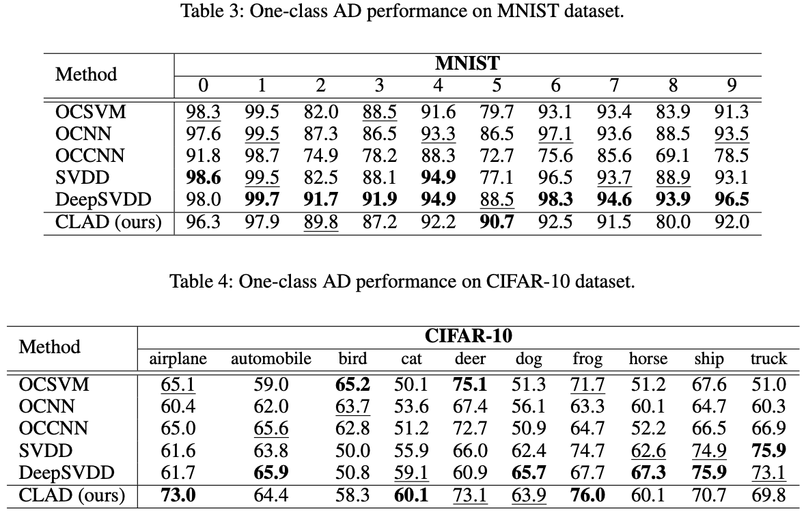
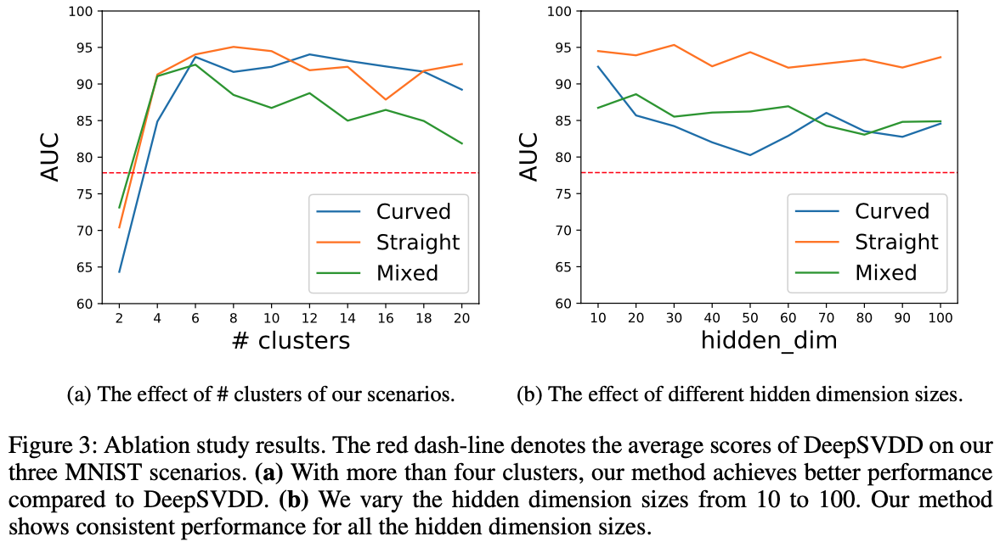

# CLAD: Confidence-based self-Labeling Anomaly Detection

This is a [PyTorch](http://pytorch.org) implementation for [\<What is Wrong with One-Class Anomaly Detection?\>](https://arxiv.org/abs/2104.09793) published at ICLR 2021 Workship on Security and Safety in Machine Learning Systems.

## Abstract

From a safety perspective, a machine learning method embedded in real-world applications is required to distinguish irregular situations. For this reason, there has been a growing interest in the anomaly detection (AD) task. Since we cabbit observe abnormal samples for most of the cases, recent AD methods attemp to formulate it as a task of classifying whether the sample is normal or not. However, they potentially fail when the given normal samples are inherited from diverse semantic labels. To tackle this problem, we introduce a latent class-condition-based AD scenario. In addition, we propose a confidence-based self-labeling AD framework tailored to our proposed scenario. Since our method leverages the hidden class information, it successfully avoids generating the undesirable loose decision region that one-class methods suffer. Our proposed framework outperforms the recent one-class AD methods in the latent multi-class scenarios.

### Requirements

### Run scripts

dataset list : MNIST, GTSRB, CIFAR-10, Tiny-ImageNet

## Scenario

          

## CLAD (Confidence-based self-Labeling Anoamly Detection)

## Categorizing Each Dataset

## Experimental Results

### Implementation Details

(clustering : [link] + ~ used multi-core tsne)
